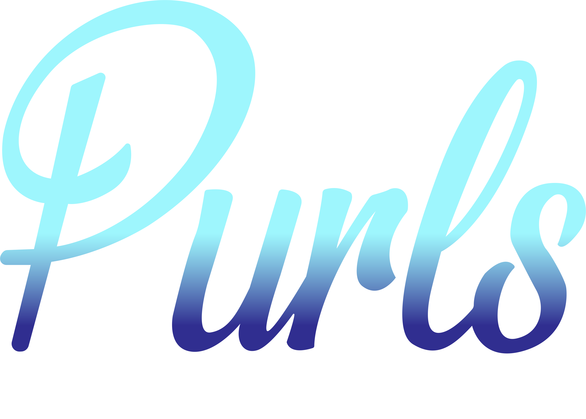

# Purls Massage Fitness & Beauty

<div align="center">



### *Experience Luxury Wellness, Massage Therapy & Fitness Coaching in the Comfort of Your Space*

[](https://react.dev/)
[](https://www.typescriptlang.org/)
[](https://vitejs.dev/)
[](https://tailwindcss.com/)
[](https://www.framer.com/motion/)

<p align="center">
  <a href="#-key-features">Key Features</a> •
  <a href="#-tech-stack">Tech Stack</a> •
  <a href="#-pages--sections">Pages & Sections</a> •
  <a href="#-interactive-controls">Controls</a> •
  <a href="#-getting-started">Getting Started</a> •
  <a href="#-project-structure">Architecture</a>
</p>

---

</div>

## Overview

**Purls Massage Fitness & Beauty** is a luxury mobile wellness web application designed to showcase premium massage therapy, corporate seated massage, personal training, and holistic beauty packages across the UK. 

Built around a unique **3D Interactive Book-Flip Interface**, this project transforms standard web browsing into an immersive visual catalogue, allowing users to flip through pages smoothly using touch gestures, keyboard arrows, or mouse navigation.

---

## Key Features

- **3D Book-Flip Experience**: Custom 3D page transformation engine delivering realistic book crease and turn physics.
- **Multi-Modal Navigation**:
  - **Keyboard Arrows**: Press `←` and `→` to flip pages effortlessly.
  - **Touch Swiping**: Mobile touch support for natural page turns.
  - **Split-Screen Click**: Click left/right halves of the screen to turn pages backward/forward.
  - **Responsive Navbar**: Quick-jump header with active page indicators and mobile drawer menu.
- **Comprehensive Service Catalog**: Detailed offerings for remedial massage, office chair massage, fitness coaching, and beauty treatments.
- **Accreditation & Trust**: Built-in qualifications grid, professional credentials, and client reference endorsements.
- **Modern Glassmorphic Aesthetic**: Deep color palette, dynamic gradients, blur effects, smooth micro-interactions, and typography optimized with Google's *Poppins* font.
- **Lightning Fast**: Powered by **Vite 6** and **React 18** for instant hot-module replacement and optimal performance.

---

## Tech Stack

| Domain | Technologies |
| :--- | :--- |
| **Frontend Framework** | [React 18](https://react.dev/) + [TypeScript](https://www.typescriptlang.org/) |
| **Build Tooling** | [Vite 6](https://vitejs.dev/) |
| **Styling & Design System** | [Tailwind CSS v4](https://tailwindcss.com/), Custom CSS 3D Keyframe Engines |
| **Animations** | [Framer Motion](https://www.framer.com/motion/) |
| **Icons & Assets** | [Lucide React](https://lucide.dev/) |
| **Typography** | [Google Fonts - Poppins](https://fonts.google.com/specimen/Poppins) |

---

## Pages & Sections

```
 Purls Massage Fitness & Beauty
 ├──  01. Home                 -> Brand intro, hero showcase & service summary
 ├──  02. Massage              -> Deep tissue, Swedish, holistic & remedial therapies
 ├──  03. Seated Massage       -> Corporate wellness & office event chair massage
 ├──  04. Personal Training    -> Fitness coaching, tailored workouts & health goals
 ├──  05. Beauty Packages      -> Luxury facials, pamper sessions & skincare routines
 ├──  06. Qualifications       -> Accredited diplomas, insurance & background
 ├──  07. References           -> Verified testimonials & corporate client reviews
 └──  08. 404 Not Found        -> Graceful handling of invalid links & quick recovery
```

---

## Interactive Controls

| Input Method | Action |
| :--- | :--- |
| **Keyboard Left (`←`)** | Flip to previous page |
| **Keyboard Right (`→`)** | Flip to next page |
| **Mouse Click (Right Half)** | Advance to next page |
| **Mouse Click (Left Half)** | Go back to previous page |
| **Mobile Touch Swipe Left** | Advance to next page |
| **Mobile Touch Swipe Right** | Go back to previous page |
| **Navbar Links** | Jump directly to any section |

---

## Project Structure

```
Purls-Massage-CodesRaft-Project/
├── public/                     # Static assets & brand media
│   └── Purls-Logo.png          # Main brand logo
├── src/
│   ├── components/             # Reusable UI components
│   │   ├── BookFlip/           # 3D Book page turn engine
│   │   ├── Navbar/             # Responsive header navigation
│   │   └── shared/             # Floating utilities (ScrollToTop, etc.)
│   ├── pages/                  # Book pages & main views
│   │   ├── Home.tsx            # Landing page
│   │   ├── Massage.tsx         # Massage therapies
│   │   ├── SeatedMassage.tsx   # Corporate chair massage
│   │   ├── PersonalTraining.tsx# Fitness coaching
│   │   ├── BeautyPackages.tsx  # Pamper & beauty treatments
│   │   ├── Qualifications.tsx  # Certifications & insurance
│   │   ├── References.tsx      # Testimonials & reviews
│   │   └── NotFound.tsx        # 404 fallback page
│   ├── types/                  # TypeScript interface declarations
│   ├── App.tsx                 # Core application layout & page orchestration
│   ├── index.css               # Global CSS variables & 3D animation rules
│   └── main.tsx                # App entry point
├── index.html                  # HTML entry point with meta tags & Google fonts
├── package.json                # Project dependencies & scripts
├── tsconfig.json               # TypeScript configuration
└── vite.config.ts              # Vite configuration
```

---

##  Getting Started

### Prerequisites

Ensure you have the following installed on your machine:
- **Node.js** (v18.0.0 or higher recommended)
- **npm** (v9.0.0 or higher)

### 1. Clone the Repository

```bash
git clone https://github.com/sadik117/purls-massage-project.git
cd purls-massage-project
```

### 2. Install Dependencies

```bash
npm install
```

### 3. Run Development Server

Launch the Vite local dev server with hot reload:

```bash
npm run dev
```

Open your browser and navigate to `http://localhost:5173`.

### 4. Build for Production

Compile TypeScript and build optimized static assets:

```bash
npm run build
```

Preview the production build locally:

```bash
npm run preview
```

---

## Customization

The design system is managed via CSS variables in [`src/index.css`](file:///d:/Projects/Purls%20Massage%20CodesRaft%20Project/src/index.css). You can easily customize primary colors, background tones, text colors, and font styles:

```css
:root {
  --color-primary: #0ea5e9;
  --color-bg: #0f172a;
  --color-text: #f8fafc;
  /* ... */
}
```

</div>
