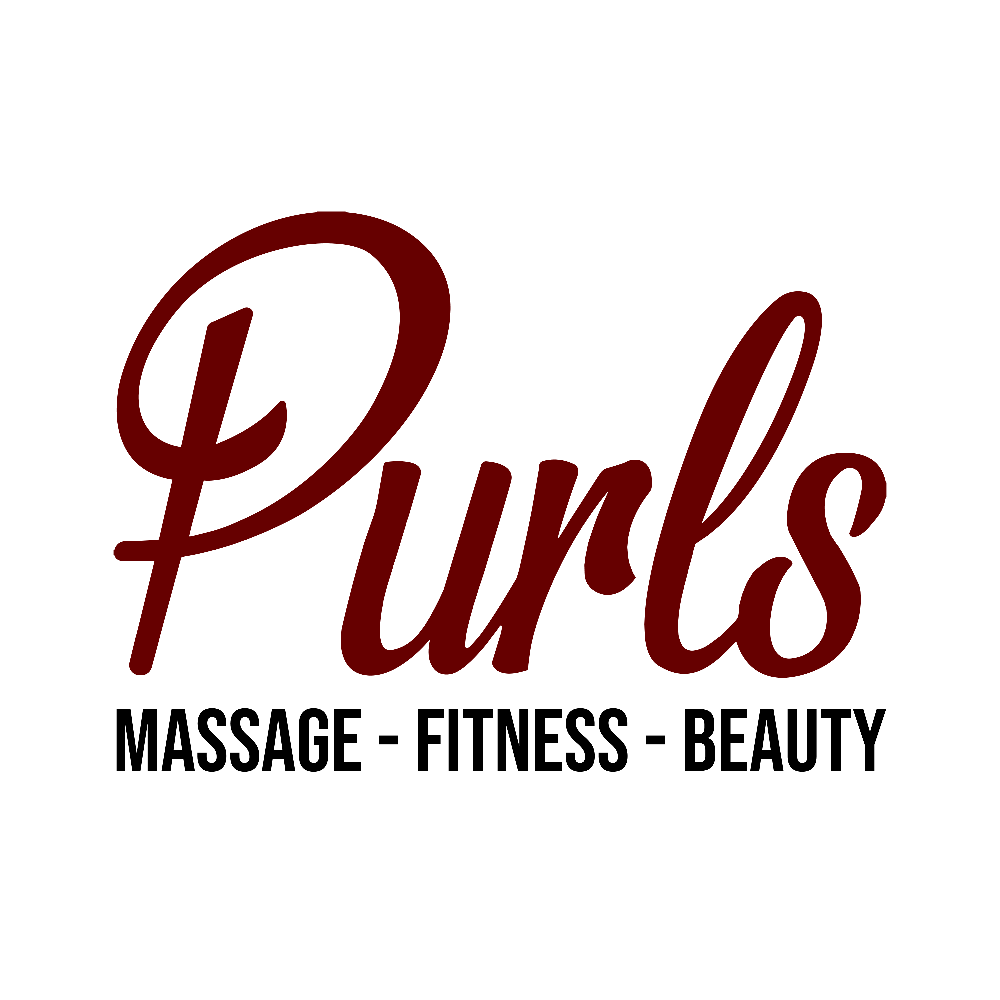

# Purls Massage Fitness & Beauty

<div align="center">



### *Mobile Wellness — Massage Therapy, Personal Training & Beauty Packages*

[](https://react.dev/)
[](https://www.typescriptlang.org/)
[](https://vitejs.dev/)
[](https://tailwindcss.com/)
[](https://www.framer.com/motion/)

<p align="center">
  <a href="#-overview">Overview</a> •
  <a href="#-key-features">Features</a> •
  <a href="#-tech-stack">Tech Stack</a> •
  <a href="#-pages">Pages</a> •
  <a href="#-interactive-controls">Controls</a> •
  <a href="#-getting-started">Getting Started</a> •
  <a href="#-project-structure">Architecture</a>
</p>

---

</div>

## Overview

**Purls Massage Fitness & Beauty** is a premium mobile wellness web application showcasing massage therapy, corporate seated massage, personal training, and holistic beauty packages across the UK.

The site's defining feature is a **3D Interactive Book-Flip Interface** — a custom page-turn engine that transforms standard web navigation into an immersive notebook-style experience. Users flip through pages using touch swipes, keyboard arrows, or mouse clicks, with realistic 3D CSS perspective animations and a warm *beige & ink* notebook aesthetic throughout.

---

## Key Features

- **3D Book-Flip Engine**: Custom CSS keyframe animations with `perspective()` per-transform for realistic page turns — built to avoid the iOS Safari parent-perspective scroll-blocking bug.
- **Notebook Aesthetic**: Warm paper tones (`#ebdcca`), ink text (`#2a2c31`), ruled page lines, spiral binding, coffee-stain watermark accents, and hand-drawn border radii (`sketched-border`).
- **Multi-Modal Navigation**:
  - **Keyboard Arrows**: `←` / `→` to flip pages.
  - **Touch Swipe**: Native passive listeners (no scroll blocking) — horizontal swipe to navigate, vertical scroll for page content.
  - **Split-Screen Click**: Click left/right halves on desktop to turn pages.
  - **Collapsible Navbar**: Animated hamburger menu with direct page jump links.
- **Fully Responsive**: Mobile-first layout across all pages. Horizontal overflow guards on every page, normalized letter-spacing on narrow viewports, and iOS-safe scrolling (`-webkit-overflow-scrolling: touch`, `overscroll-behavior-y: contain`).
- **Framer Motion Animations**: Scroll-triggered `fadeUp` reveals, animated testimonial carousel, polaroid-tilt reference photo grids.
- **Service Catalog**: 12 massage types, corporate seated massage packages, 10-session personal training programme, and a 2-hour beauty package with treatment tiers.
- **Qualifications & Trust**: Certificate gallery in polaroid style, client testimonial carousel with star ratings, and reference letter photo grids.

---

## Tech Stack

| Domain | Technologies |
| :--- | :--- |
| **Frontend Framework** | [React 18](https://react.dev/) + [TypeScript](https://www.typescriptlang.org/) |
| **Build Tooling** | [Vite 6](https://vitejs.dev/) |
| **Styling** | [Tailwind CSS v4](https://tailwindcss.com/), Vanilla CSS 3D Keyframe Engine |
| **Animations** | [Framer Motion 11](https://www.framer.com/motion/) |
| **Icons** | [Lucide React](https://lucide.dev/) |
| **Typography** | [Caveat](https://fonts.google.com/specimen/Caveat) (handwriting) · [Special Elite](https://fonts.google.com/specimen/Special+Elite) (typewriter) · [EB Garamond](https://fonts.google.com/specimen/EB+Garamond) (serif body) |

---

## Pages

```
Purls Massage Fitness & Beauty
├── 01. Home                → Brand intro, services overview, contact & map
├── 02. Massage             → 12 massage modalities with descriptions & pricing
├── 03. Seated Massage      → Corporate chair massage packages & pricing tiers
├── 04. Personal Training   → 10-session rehabilitation & strength programme
├── 05. Beauty Packages     → 2-hour beauty treatment package with treatment list
├── 06. Qualifications      → Diploma & certificate gallery, career stats
├── 07. References          → Client testimonial carousel & reference letter grids
└── 08. 404 Not Found       → Graceful fallback with book-flip navigation
```

---

## Interactive Controls

| Input | Action |
| :--- | :--- |
| **`←` Arrow Key** | Flip to previous page |
| **`→` Arrow Key** | Flip to next page |
| **Click — Right Half** *(desktop)* | Advance to next page |
| **Click — Left Half** *(desktop)* | Go to previous page |
| **Swipe Left** *(mobile)* | Advance to next page |
| **Swipe Right** *(mobile)* | Go to previous page |
| **Navbar Links** | Jump directly to any page |
| **Scroll to Top Button** | Returns to top of current page |

> **Mobile Note:** Touch listeners are registered as `{ passive: true }` so the browser starts vertical scrolling immediately without waiting for JS — eliminating the common scroll-blocking issue inside book-flip interfaces.

---

## Project Structure

```
purls-massage-project/
├── public/                       # Static assets & brand media
│   ├── Purls_Logo_Full.png       # Primary brand logo
│   ├── remedial-massage.png      # Service imagery
│   └── ...                       # Other service images
├── src/
│   ├── components/
│   │   ├── BookFlip/
│   │   │   └── BookFlip.tsx      # 3D page-flip engine (touch, keyboard, click)
│   │   ├── Navbar/
│   │   │   └── Navbar.tsx        # Collapsible hamburger navbar
│   │   └── shared/
│   │       ├── NeedHelp.tsx      # WhatsApp / email contact widget
│   │       ├── ScrollToTop.tsx   # Floating scroll-to-top button
│   │       └── Copyright.tsx     # Footer copyright line
│   ├── pages/
│   │   ├── Home.tsx              # Landing page
│   │   ├── Massage.tsx           # Massage therapies catalog
│   │   ├── SeatedMassage.tsx     # Corporate chair massage
│   │   ├── PersonalTraining.tsx  # Fitness coaching programme
│   │   ├── BeautyPackages.tsx    # Beauty treatment packages
│   │   ├── Qualifications.tsx    # Credentials & certificates
│   │   ├── References.tsx        # Testimonials & reference letters
│   │   └── NotFound.tsx          # 404 fallback
│   ├── types/                    # TypeScript interface declarations
│   ├── App.tsx                   # Page orchestration, keyboard & routing
│   ├── index.css                 # Design tokens, 3D keyframes, layout classes
│   └── main.tsx                  # App entry point
├── index.html                    # HTML shell with Google Fonts import
├── package.json
├── tsconfig.json
└── vite.config.ts
```

---

## Design System

The design system lives in [`src/index.css`](./src/index.css) as CSS custom properties:

```css
:root {
  --color-paper:  #ebdcca;  /* Warm notebook page background */
  --color-ink:    #2a2c31;  /* Deep charcoal text & borders   */
  --color-accent: #8b5e3c;  /* Warm brown for highlights       */

  --font-handwriting: 'Caveat', cursive;
  --font-typewriter:  'Special Elite', serif;
  --font-serif:       'EB Garamond', serif;
}
```

Key utility classes:

| Class | Purpose |
| :--- | :--- |
| `.notebook-page` | Ruled paper background, base page container |
| `.spiral-binding` | Left-edge binding decoration with ring pseudo-element |
| `.page-scroll` | Inner scroll container — `overflow-y: scroll` with iOS momentum |
| `.sketched-border` | Organic hand-drawn border radius |
| `.coffee-stain` | Radial gradient watermark accent |
| `.book-viewport` | Outer 3D transform container (no parent `perspective` — iOS fix) |
| `.page-layer` | Individual page layer; `perspective()` applied per keyframe |

---

## Getting Started

### Prerequisites

- **Node.js** v18+ recommended
- **npm** v9+

### 1. Clone

```bash
git clone https://github.com/sadik117/purls-massage-project.git
cd purls-massage-project
```

### 2. Install

```bash
npm install
```

### 3. Develop

```bash
npm run dev
```

Open `http://localhost:5173` in your browser.

### 4. Build

```bash
npm run build
```

### 5. Preview Production Build

```bash
npm run preview
```

---

<div align="center">

*Built with care for Purls Massage Fitness & Beauty —  UK*

</div>
